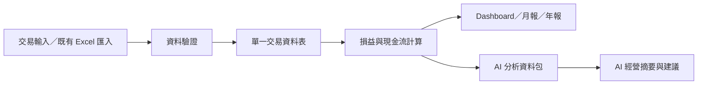

# 方糖民宿 AI CFO

方糖民宿 AI CFO 是一套以「單一交易資料表」為核心的財務管理與 AI 經營分析規格庫。本版本先解決 2026 年起的收入、支出、損益、現金流、年度彙總與管理摘要；固定資產及需依賴 PMS 的旅宿營運指標留待後續階段。

## 專案狀態

- 規格版本：0.2.0-draft
- 文件基準日：2026-07-26
- 階段：財務核心與營運 Agent 開發交接規格；整合功能尚未實作
- 使用單位：方糖民宿
- 資料起始日：2026-01-01

## 已知營運範圍

- 客房共 7 間：201、202、203、204、301、302、303
- 私廚早餐
- 入住時間：15:00
- 退房時間：11:00
- 現行收入來源：Booking、官網、電話訂房、公務住宿、活動收入
- 未來收入來源：Agoda、Airbnb
- 成本大類：人事、房務、食材、公共營運、行銷平台、訂閱服務、貸款、其他
- PMS：OwlTing OwlNest；規劃唯讀接收，尚未取得可用 API 文件
- 行動入口：ChatGPT Plus 私人 GPT + Actions
- 工作通知：LINE Official Account + Messaging API
- 執行主機：每日開機的民宿 Mac
- 設備整合：規則引擎選擇白名單 Shortcut，再由 HomeKit 執行

## V1 核心原則

1. 所有月份共用單一交易表，不以每月工作表作為資料來源。
2. 損益與現金流分開計算；貸款本金不列入損益費用。
3. 財務報表先以管理會計用途為主，正式報稅仍由會計人員確認。
4. AI 只能依已驗證資料提出解讀、異常與建議，不得捏造原因。
5. ADR、RevPAR、入住率須待每日房況或 PMS 資料可用後才正式啟用。
6. 固定資產、折舊及保固管理列入 Phase 2。
7. 線上訂金與現場尾款必須連結同一筆訂房；付款階段不等於收入來源。
8. 訂金比例、尾款及取消政策由 PMS／訂房平台控制；AI CFO 僅接收資料，不回寫或改變訂房規則。

## 文件導覽

- [產品願景](docs/Vision.md)
- [財務產品需求](docs/Financial_PRD.md)
- [商業與財務規則](docs/Business_Rules.md)
- [資料庫設計](docs/Database_Design.md)
- [Dashboard 設計](docs/Dashboard_Design.md)
- [AI 分析引擎](docs/AI_Analysis_Engine.md)
- [AI 開發交接入口](docs/AI_Development_Handoff.md)
- [營運 Agent 架構](docs/Operations_Agent_Architecture.md)
- [營運資料模型](docs/Operations_Data_Model.md)
- [OwlNest PMS 整合](docs/OwlNest_PMS_Integration.md)
- [ChatGPT 手機 Actions](docs/Mobile_ChatGPT_Actions.md)
- [LINE 通知設計](docs/LINE_Notification_Design.md)
- [HomeKit Shortcuts 設計](docs/HomeKit_Shortcuts_Design.md)
- [餐點選擇與備料流程](docs/Meal_and_Prep_Workflow.md)
- [驗收測試計畫](docs/Acceptance_Test_Plan.md)
- [開發路線圖](docs/Development_Roadmap.md)
- [營運 MVP 專案進度表](docs/Operations_MVP_Progress.md)
- [2026 原始財務活頁簿評估](docs/Source_Workbook_Assessment.md)
- [決策紀錄](docs/Decision_Log.md)
- [變更紀錄](docs/CHANGELOG.md)
- [待辦清單](TODO.md)

## 建議資料流



營運 Agent 的完整資料流、權限與安全界線見
[AI Development Handoff](docs/AI_Development_Handoff.md)。

## 文件治理

- `docs/` 是需求與規則的唯一正式來源。
- 功能改動應先更新規格及 [Decision Log](docs/Decision_Log.md)，再修改實作。
- 所有待確認事項使用 `TBC-*` 編號，假設使用 `ASM-*` 編號。
- 金額預設為新台幣，不使用浮點數儲存。
- 不得將銀行帳號、信用卡完整卡號、住客個資提交至 Git。

## Git 快速開始

```bash
git init
git add .
git commit -m "Add AI CFO V1 specification baseline"
git branch -M main
git remote add origin <YOUR_GITHUB_REPOSITORY_URL>
git push -u origin main
```

若專案已經是 Git repository，略過 `git init` 與 `git remote add origin`。

## 免責說明

本專案提供內部經營管理、資料整理與決策支援，不構成會計、稅務、法律或投資意見。正式帳務、申報與報表格式須由合格專業人員覆核。
