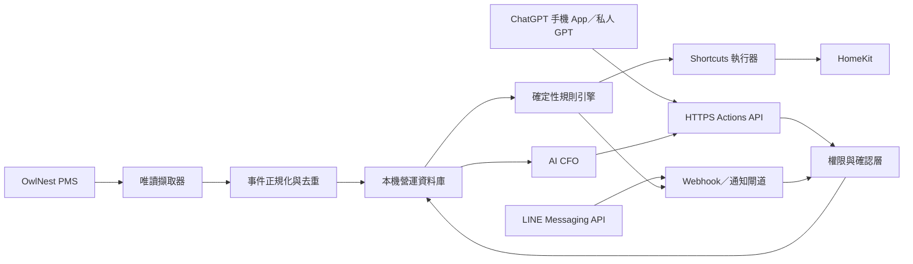

# AI Development Handoff

## 1. 文件目的

本文件是下一位 AI Agent 或工程團隊的開發入口。專案目前只完成規劃與財務 Excel 原型，**尚未實作 OwlNest、LINE、ChatGPT Actions 或 HomeKit 整合**。開發者不得把規格中的預定行為誤認為已上線功能。

## 2. 已確認條件

| 項目 | 已確認內容 |
|---|---|
| 使用單位 | 方糖民宿 |
| 客房 | 201、202、203、204、301、302、303 |
| 早餐 | 私廚早餐 |
| 入住／退房 | 15:00／11:00 |
| 財務起始 | 2026-01-01 |
| PMS | OwlTing OwlNest；目前未取得可用 API 文件 |
| AI 介面 | ChatGPT Plus；手機使用私人 Custom GPT + Actions |
| 通知 | LINE Official Account 已建立；Messaging API 尚待設定與測試 |
| 執行主機 | 民宿 Mac，每日開機 |
| 家庭自動化 | HomeKit；由使用者建立或調整 Shortcuts |
| PMS 權責 | PMS 控制訂金、尾款、取消及退款原則；本系統唯讀接收 |
| 年繳費用 | 現金流於付款日全額列示；管理損益按服務期間逐月攤提 |
| 固定資產 | Phase 2；使用者完成盤點後匯入 |

## 3. 系統角色與唯一真實來源

| 系統 | 角色 | 不負責 |
|---|---|---|
| OwlNest | 訂單、付款狀態及訂房條款來源 | AI 財務判斷、HomeKit 控制 |
| 本機營運資料庫 | 標準化事件、任務、稽核與整合狀態 | 取代 PMS 原始紀錄 |
| AI CFO | 確定性財務數字的解讀與建議 | 自行計算或猜測財務數字 |
| 私人 GPT | 經營者手機對話入口 | 保存 PMS 密碼或完整住客資料 |
| LINE | 工作群組通知與簡短互動 | 完整財務報表與敏感資料庫 |
| 規則引擎 | 決定通知與 Shortcut 是否可執行 | 讓生成式 AI 任意控制設備 |
| Shortcuts／HomeKit | 執行已核准的家庭自動化 | 解讀訂單或自行形成營運政策 |

## 4. 目標架構

外部服務不得直接連入本機裸露埠。ChatGPT Actions 與 LINE webhook 均需受驗證的 HTTPS 入口、速率限制、稽核與金鑰輪替。

## 5. 必讀順序

1. [Vision](Vision.md)
2. [Financial PRD](Financial_PRD.md)
3. [Business Rules](Business_Rules.md)
4. [Operations Agent Architecture](Operations_Agent_Architecture.md)
5. [Operations Data Model](Operations_Data_Model.md)
6. [OwlNest PMS Integration](OwlNest_PMS_Integration.md)
7. [Mobile ChatGPT Actions](Mobile_ChatGPT_Actions.md)
8. [LINE Notification Design](LINE_Notification_Design.md)
9. [HomeKit Shortcuts Design](HomeKit_Shortcuts_Design.md)
10. [Meal and Prep Workflow](Meal_and_Prep_Workflow.md)
11. [Acceptance Test Plan](Acceptance_Test_Plan.md)
12. [Decision Log](Decision_Log.md)
13. [Development Roadmap](Development_Roadmap.md)

## 6. 開發工作包

| 工作包 | 前置條件 | 主要成果 | 完成門檻 |
|---|---|---|---|
| WP-01 資料核心 | 財務規則確認 | schema、migration、測試資料 | 約束、去重、稽核測試通過 |
| WP-02 財務引擎 | WP-01 | 損益、現金流、攤提、下鑽 | 與 Excel 對帳且零差異 |
| WP-03 OwlNest 探索 | 遮蔽截圖、測試帳號 | 欄位地圖、擷取可行性報告 | 不寫入 PMS，可偵測頁面異常 |
| WP-04 OwlNest Collector | WP-01、WP-03 | 快照、轉換、事件與重試 | 同一訂單重抓不重複 |
| WP-05 LINE Gateway | Channel 設定、測試群組 | webhook、簽章、推播、去重 | 重送事件不重複執行 |
| WP-06 Actions API | HTTPS 與驗證決策 | OpenAPI、讀取及草稿工具 | 私人 GPT 手機端端到端通過 |
| WP-07 規則引擎 | WP-01、通知矩陣 | 通知、任務、衝突優先序 | 以固定測試資料可重現 |
| WP-08 Shortcuts | 設備與 Shortcut 清冊 | 執行器、逾時、稽核、手動覆寫 | 失敗時安全停用且通知 |
| WP-09 營運化 | WP-01～08 | 開機啟動、備份、監控、SOP | 斷網、重啟、還原演練通過 |

## 7. 不可越過的安全界線

- 不繞過 CAPTCHA、二階段驗證、存取限制或系統商安全機制。
- 未確認 OwlNest 使用條款與帳戶許可前，不進行正式自動擷取。
- 不將密碼、Cookie、LINE Channel Secret、Access Token、OpenAI 金鑰提交 Git 或貼入對話。
- 寫入財務、修改住客需求、發送群組通知及執行設備動作採草稿／確認或明確規則。
- 住客資料採最少揭露；LLM 一般不接收完整姓名、電話、證件、付款資料。
- 抽水馬達等可能造成財產或人身風險的設備，在用途與安全條件未確認前不得自動化。

## 8. 開發前仍需使用者提供

| 編號 | 資料 | 提供方式 |
|---|---|---|
| TBC-OPS-001 | OwlNest 登入網址、是否 2FA/CAPTCHA | 文字說明；密碼不提供 |
| TBC-OPS-002 | 訂單列表、詳情、付款、備註頁遮蔽截圖 | 移除姓名、電話、訂單碼 |
| TBC-OPS-003 | OwlNest 是否可 CSV／Excel／列印 | 介面勾選或截圖 |
| TBC-OPS-004 | LINE Channel 是否已啟用 Messaging API、測試群組 | 不貼 Secret／Token |
| TBC-OPS-005 | 通知對象、時機與安靜時段 | 表格 |
| TBC-OPS-006 | HomeKit 設備、用途、房間及安全預設 | 清冊 |
| TBC-OPS-007 | 已建立的 Shortcut 精確名稱及輸入／輸出 | 清冊 |
| TBC-OPS-008 | 抽水馬達用途及「下雨不運轉」的安全原因 | 文字說明 |
| TBC-OPS-009 | 外部 HTTPS 入口方案與網域 | 開發階段決定 |

## 9. 交付規則

每個工作包必須同時提交：

- 程式與資料庫 migration。
- 單元、整合及失敗情境測試。
- 規格與 Decision Log 更新。
- 不含秘密的 `.env.example`。
- 部署、停止、復原與回退說明。
- 實際驗證證據，不以「程式可編譯」取代端到端驗收。
