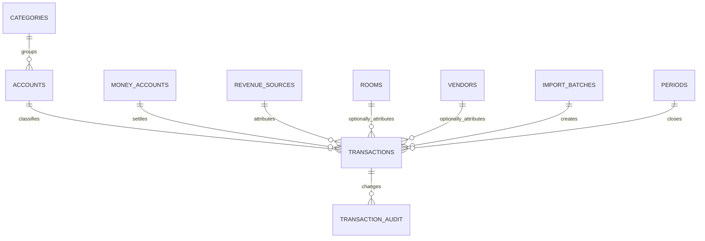

# Database Design

## 1. 設計目標

資料模型以單一交易表為核心，同時支援 Excel V2 與未來 Web 系統。V1 可先以試算表實作，但欄位與識別碼應遵循本設計。

## 2. 概念模型

## 3. 核心資料表

### transactions

| 欄位 | 型別 | 必填 | 說明 |
|---|---|---:|---|
| id | UUID | 是 | 交易唯一識別碼 |
| transaction_date | date | 是 | 報表歸屬日 |
| transaction_type | enum | 是 | income、expense、refund、loan_principal、loan_interest、transfer、owner_contribution、owner_withdrawal、adjustment |
| account_id | UUID | 是 | 財務科目 |
| amount | decimal(18,2) | 是 | 正數 |
| money_account_id | UUID | 是 | 實際收付帳戶 |
| counterparty_account_id | UUID | 否 | 轉帳對方帳戶 |
| revenue_source_id | UUID | 否 | 收入來源 |
| room_id | UUID | 否 | 房號；僅在可合理歸屬時填 |
| vendor_id | UUID | 否 | 供應商／收付款對象 |
| payment_method | enum | 否 | 現金、轉帳、信用卡等 |
| description | text | 是 | 摘要 |
| document_no | varchar(100) | 否 | 憑證或外部交易編號 |
| occurred_at | datetime | 否 | 若需保留時間 |
| import_batch_id | UUID | 否 | 匯入批次 |
| source_row_key | varchar(255) | 否 | 原檔列識別 |
| asset_review_status | enum | 是 | not_applicable、pending、confirmed_asset、confirmed_expense |
| status | enum | 是 | draft、posted、void |
| created_at | datetime | 是 | 建立時間 |
| updated_at | datetime | 是 | 修改時間 |
| deleted_at | datetime | 否 | 軟刪除 |

約束：

- `amount > 0`
- `transaction_date >= 2026-01-01`，期初餘額例外
- transfer 必須有 `counterparty_account_id`
- income／refund 才可使用 `revenue_source_id`
- 已關帳期間的 posted 交易禁止直接修改

### categories

| 欄位 | 型別 | 必填 | 說明 |
|---|---|---:|---|
| id | UUID | 是 | 識別碼 |
| code | varchar(20) | 是 | 大類代碼 |
| name_zh | varchar(100) | 是 | 中文名稱 |
| report_section | enum | 是 | revenue、operating_expense、finance、asset、equity、other |
| sort_order | integer | 是 | 報表順序 |
| active | boolean | 是 | 是否啟用 |

預設大類：收入、人事、房務、食材、公共營運、行銷平台、訂閱服務、貸款、其他。

### accounts

| 欄位 | 型別 | 必填 | 說明 |
|---|---|---:|---|
| id | UUID | 是 | 識別碼 |
| code | varchar(20) | 是 | 科目代碼 |
| name_zh | varchar(100) | 是 | 科目名稱 |
| category_id | UUID | 是 | 所屬大類 |
| normal_direction | enum | 是 | inflow、outflow、non_cash |
| pnl_treatment | enum | 是 | revenue、expense、excluded、pending |
| cashflow_treatment | enum | 是 | operating、investing、financing、transfer、non_cash |
| active | boolean | 是 | 是否啟用 |
| valid_from | date | 是 | 生效日 |
| valid_to | date | 否 | 失效日 |

### revenue_sources

| code | 名稱 | V1 狀態 |
|---|---|---|
| BOOKING | Booking | 啟用 |
| WEBSITE | 官網 | 啟用 |
| PHONE | 電話訂房 | 啟用 |
| BUSINESS | 公務住宿 | 啟用 |
| WALKIN | 現場付款 | 暫啟用，待釐清 |
| EVENT | 活動收入 | 啟用 |
| AGODA | Agoda | 停用／未來 |
| AIRBNB | Airbnb | 停用／未來 |

### rooms

| 欄位 | 型別 | 必填 | 說明 |
|---|---|---:|---|
| id | UUID | 是 | 識別碼 |
| room_no | varchar(10) | 是 | 201 等，文字格式 |
| floor | integer | 是 | 2 或 3 |
| room_type | varchar(100) | 否 | 待確認 |
| capacity | integer | 否 | 待確認 |
| active | boolean | 是 | 是否啟用 |

預載：201、202、203、204、301、302、303。

### money_accounts

保存現金、銀行、零用金、信用卡等資金帳戶；不得保存完整銀行帳號或卡號。

| 欄位 | 型別 | 必填 |
|---|---|---:|
| id | UUID | 是 |
| code | varchar(20) | 是 |
| name | varchar(100) | 是 |
| account_type | enum | 是 |
| opening_balance | decimal(18,2) | 否 |
| opening_date | date | 否 |
| active | boolean | 是 |

### periods

| 欄位 | 型別 | 必填 | 說明 |
|---|---|---:|---|
| period | char(7) | 是 | YYYY-MM |
| status | enum | 是 | open、closed |
| closed_at | datetime | 否 | 關帳時間 |
| closed_by | UUID/string | 否 | 操作者 |
| reopen_reason | text | 否 | 重開原因 |

### import_batches

保存來源檔名、雜湊、匯入時間、成功／失敗筆數與回復狀態，用於防重與追蹤。

### transaction_audit

保存交易變更前後 JSON、動作、操作者、時間與原因。實作若使用 Excel，應至少保留匯入批次、更新時間與更正紀錄表。

## 4. 建議科目初稿

### 收入

- 4001 住宿收入
- 4010 活動收入
- 4090 其他收入
- 4098 收入折讓
- 4099 退款

收入來源由獨立欄位記錄，不為每個通路建立不同會計科目。

### 人事

- 5101 薪資
- 5102 工讀與臨時人員
- 5103 加班與獎金
- 5104 雇主負擔保險

### 房務

- 5201 清潔用品
- 5202 客房備品
- 5203 洗滌費
- 5204 布巾與寢具耗損

### 食材

- 5301 早餐食材
- 5302 飲品與咖啡
- 5303 水果與點心
- 5304 調味及廚房耗材
- 5309 食材報廢／損耗

### 行銷平台

- 5401 OTA 佣金
- 5402 金流手續費
- 5403 廣告與推廣
- 5404 網站行銷

### 公共營運

- 5451 水費
- 5452 電費
- 5453 瓦斯
- 5454 頻寬與網路
- 5455 保全與消防
- 5456 房屋及營運相關稅費
- 5457 維修與修繕

### 訂閱服務

- 5501 PMS
- 5502 AI／軟體訂閱
- 5503 雲端服務
- 5504 網域與憑證

### 貸款及其他

- 5601 貸款利息
- 5602 貸款手續費
- 5699 貸款本金（損益排除）
- 5999 其他營運費用

## 5. 索引與唯一性

- `accounts.code` 唯一。
- `rooms.room_no` 唯一。
- `revenue_sources.code` 唯一。
- 建議索引：`transaction_date`、`account_id`、`money_account_id`、`revenue_source_id`、`import_batch_id`。
- 可用 `document_no + amount + transaction_date` 作為重複偵測信號，但不可當唯一限制。

## 6. 資料保留與隱私

- 不保存完整信用卡號、住客身分證或非必要個資。
- 備註匯出給 AI 前應遮蔽姓名、電話、Email、帳號。
- 原始匯入檔與更正歷史應依備份政策保存。

## 7. Phase 2 擴充

- assets、depreciation_entries
- subscriptions、renewal_schedules
- loans、loan_installments
- budgets、budget_lines

PMS 整合再新增：

- stays
- room_inventory_daily
- reservations
- room_revenue_daily

## 8. 待確認

- `TBC-014` 技術實作先採 Excel、SQLite 或 PostgreSQL。
- `TBC-015` 帳戶清單與期初餘額。
- `TBC-016` 已決定恢復公共營運大類；科目細項仍可依實際交易補充。
- `TBC-017` 交易是否需要附件連結。
- `TBC-018` 使用者與權限是否在 Excel V2 階段實作。
