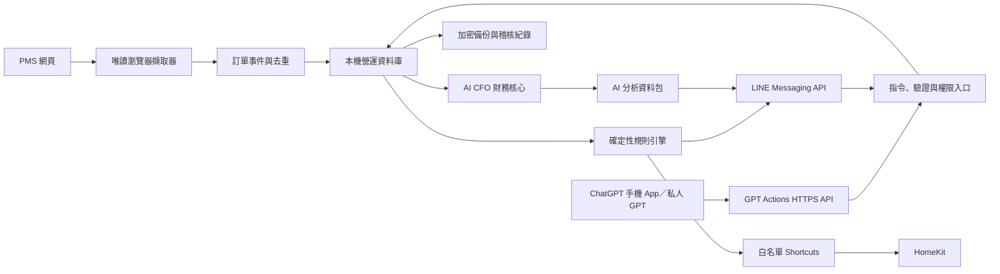

# 方糖民宿 AI 營運 Agent 架構

## 1. 目標

在方糖民宿每日開機的 Mac 運行本地 Agent，將目前未取得可用 API 文件的 OwlTing OwlNest 訂單、住客需求、採購、工作通知、HomeKit Shortcuts 及 AI CFO 串成一個可追溯系統。經營者主要透過 ChatGPT 手機 App 的私人 GPT 溝通，LINE 工作群組接收必要提醒。

## 2. 系統邊界

### Agent 可以

- 定時唯讀檢查 PMS 新訂單、異動與取消。
- 擷取入住／退房、房號、用餐時間、飲食禁忌及必要備註。
- 建立訂單事件、任務與通知。
- 接收 LINE 文字或照片，建立待確認採購紀錄。
- 查詢今日入住、明日早餐、待辦、收入與成本。
- 依既定規則向授權群組推送訊息。
- 入住日已到且訂單未取消時，建立尾款推定已收及接待確認待辦。

### Agent 預設不可以

- 修改 PMS 訂單、房價、房量或付款狀態。
- 自動取消訂單、退款、付款或發送住客訊息。
- 將完整住客個資、付款資訊或登入憑證傳給 LLM。
- 在頁面變更、登入失效或資料矛盾時自行猜測。

## 3. 邏輯架構

## 4. 建議本機元件

| 元件 | 職責 |
|---|---|
| Agent Service | 排程、任務佇列、重試及健康檢查 |
| Browser Collector | 登入 PMS、讀取訂單列表及詳情 |
| PostgreSQL／SQLite | 訂單、住客需求、採購、任務、通知與財務事件 |
| Rules Engine | 何時通知、通知誰、需要哪些欄位 |
| LINE Gateway | webhook、簽章驗證、回覆與群組推送 |
| ChatGPT Actions API | 讓私人 GPT 從手機安全查詢或建立待確認操作 |
| AI Layer | 自然語言解析、摘要與建議；不得直接寫入正式交易 |
| Audit Log | 記錄來源、時間、差異、操作人與核准結果 |
| Shortcut Runner | 僅執行規則引擎選出的白名單 Shortcut |

V1 原型可用 SQLite；多服務、遠端存取或資料量增加後轉 PostgreSQL。

## 5. PMS 擷取策略

1. 先確認 OwlNest 系統商條款及帳戶允許自動化存取。
2. 優先尋找 PMS 內建 CSV／Excel 下載或列印資料。
3. 無匯出時使用瀏覽器自動化唯讀擷取。
4. 人工登入一次後保存登入狀態；憑證及 Cookie 放在本機私有目錄並排除 Git。
5. 以 PMS 訂單編號、更新時間與內容雜湊防止重複。
6. 每次同步先建立原始快照，再轉成標準欄位。
7. 欄位缺漏或頁面結構改變時停止該批次並發警示。
8. 不繞過 CAPTCHA、二階段驗證或其他安全控制。

## 6. 訂單與住客資料

最小欄位：

- PMS 訂單編號與來源平台。
- 訂單狀態及最後更新時間。
- 入住／退房日期。
- 房號或房型。
- 住客稱呼；通知層避免傳送不必要全名。
- 成人、兒童及早餐人數。
- 用餐日期與時間。
- 飲食禁忌、過敏、素食及特殊需求。
- 訂金、尾款、退款及付款狀態事件。
- 原始來源與同步批次。

OwlNest 未輸入現場尾款時，本機系統不回寫 PMS。系統依入住日與未取消狀態建立 `presumed_collected`，接待人員在入住流程確認付款方式與金額後才轉成正式付款事件。

## 7. LINE 使用情境

### 管理者輸入

- 「今天全聯採購早餐食材 2,350，現金。」
- 「明天有哪些人吃早餐？」
- 「203 房改成 08:30 用餐，兩位不吃牛肉。」
- 「這個月食材成本率多少？」
- 「203 已核驗證件，尾款 2,400 現金，早餐 08:30，兩位不吃牛肉。」

AI 先解析成草稿並回覆確認；確認後才寫入正式資料。

### 工作群組通知

- 新訂單：日期、房型／房號、人數及必要備註。
- 入住前：預計入住時間、用餐時間及房務待辦。
- 早餐：人數、時間與飲食禁忌。
- 取消／異動：只顯示工作所需差異。
- 系統異常：PMS 登入失效、同步失敗或欄位變更。

## 7.1 ChatGPT 手機介面

近期實作採「私人 Custom GPT + Actions」：

- GPT 在 ChatGPT 網頁版建立及設定。
- 日常使用可在 ChatGPT iOS／Android App 開啟該 GPT。
- Actions 透過 OpenAPI Schema 呼叫方糖民宿的 HTTPS API。
- 本地服務不可直接裸露至網際網路；使用受驗證的入口、短效憑證、來源限制及完整稽核。
- 讀取工具可直接回覆；建立採購、修改用餐資訊或發送群組通知須先產生草稿並要求確認。

第一批 Actions：

| Action | 性質 | 用途 |
|---|---|---|
| `get_today_arrivals` | 唯讀 | 查詢今日入住 |
| `get_upcoming_meals` | 唯讀 | 查詢用餐時間、早餐人數及飲食禁忌 |
| `get_financial_summary` | 唯讀 | 查詢收入、成本率與現金流 |
| `create_purchase_draft` | 建立草稿 | 從自然語言建立採購草稿 |
| `confirm_purchase` | 寫入 | 核准後寫入正式採購／財務交易 |
| `update_meal_requirement_draft` | 建立草稿 | 建立用餐或禁忌異動草稿 |
| `get_reception_checklist` | 唯讀 | 查詢證件、用餐及尾款待確認項目 |
| `complete_reception_draft` | 建立草稿 | 建立入住接待確認草稿 |
| `confirm_reception` | 寫入 | 核准證件核驗、用餐與尾款確認 |
| `send_group_notification` | 重要動作 | 經確認後推送 LINE 工作群組 |

Apps SDK／MCP 仍保留為未來介面；截至目前，ChatGPT 自訂 MCP App 主要在網頁端使用，手機優先採 Custom GPT Actions。

## 8. 通知與權限

- 管理者私訊可查財務；一般工作群組不可查完整財務。
- 群組只接收最少必要住客資料。
- 用 LINE webhook event ID 去重，避免重複執行。
- 所有 webhook 必須驗證 LINE 簽章。
- 高風險命令需二次確認及操作人紀錄。

## 9. 可靠性

- 本機服務開機自動啟動。
- PMS 同步採排程加手動重試。
- 每日備份資料庫；定期驗證還原。
- 同步、通知、財務寫入各自有事件狀態及錯誤佇列。
- 網路中斷時保留任務，恢復後按事件 ID 重送。

## 10. 分階段交付

### A. 財務核心

完成單一交易表、損益、現金流、成本細項與年度報表。

### B. 本機資料庫

建立訂單、住宿、餐飲需求、採購、任務與通知資料表。

### C. PMS 唯讀原型

以一個測試帳號及少量訂單驗證登入、擷取、快照、差異及去重。

### D. LINE 測試入口

建立 Official Account、webhook、管理者白名單及測試群組。

### E. 工作流程

串接新訂單、入住、早餐、禁忌、採購與財務草稿。

### F. 正式營運

加入健康檢查、備份、稽核、權限、失敗通知及操作手冊。

### G. HomeKit／Shortcuts

先完成設備與 Shortcut 清冊，再用確定性規則引擎執行。AI 不得直接指定 HomeKit 裝置命令；抽水馬達等高風險設備在用途及安全預設確認前保持停用。

## 11. 開始 PMS 原型前需要的資料

- OwlNest 正式登入網址。
- 可供測試的帳號；密碼不要放入 Git 或聊天。
- 是否有二階段驗證或 CAPTCHA。
- 訂單列表、訂單詳情及付款頁面的遮蔽個資截圖。
- PMS 是否支援 CSV、Excel、列印或報表下載。
- 同步頻率需求，例如每 5、15 或 30 分鐘。
- 新訂單、取消、入住、用餐及禁忌通知的群組與時機。

## 12. 相關文件

- [Vision](Vision.md)
- [Financial PRD](Financial_PRD.md)
- [Database Design](Database_Design.md)
- [Development Roadmap](Development_Roadmap.md)
- [Business Rules](Business_Rules.md)
- [AI Development Handoff](AI_Development_Handoff.md)
- [Operations Data Model](Operations_Data_Model.md)
- [OwlNest PMS Integration](OwlNest_PMS_Integration.md)
- [Mobile ChatGPT Actions](Mobile_ChatGPT_Actions.md)
- [LINE Notification Design](LINE_Notification_Design.md)
- [HomeKit Shortcuts Design](HomeKit_Shortcuts_Design.md)
- [Acceptance Test Plan](Acceptance_Test_Plan.md)
