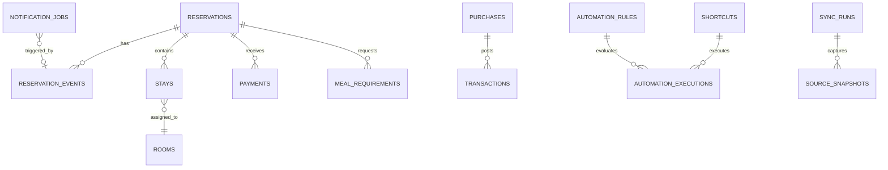

# Operations Data Model

## 1. 目的

本模型延伸 [Database Design](Database_Design.md) 的財務核心，支援 OwlNest 訂單、住宿、用餐、採購、通知與 HomeKit 規則。正式實作時可先用 SQLite，但欄位及識別碼須保持可遷移至 PostgreSQL。

## 2. 關聯

## 3. 主要資料表

### reservations

`id`, `source_system`, `external_id`, `source_channel`, `status`, `arrival_date`, `departure_date`, `room_type`, `guest_count_adult`, `guest_count_child`, `source_version`, `last_source_update_at`, `last_synced_at`, `created_at`, `updated_at`

唯一鍵：`source_system + external_id`。

### reservation_events

`id`, `reservation_id`, `event_type`, `source_event_id`, `source_version`, `event_hash`, `occurred_at`, `received_at`, `payload_redacted`, `sync_run_id`

唯一鍵優先使用 `source_system + source_event_id`；來源無 event ID 時使用內容雜湊及版本。

### stays

`id`, `reservation_id`, `room_id`, `scheduled_check_in_at`, `scheduled_check_out_at`, `actual_check_in_at`, `actual_check_out_at`, `status`

### payments

`id`, `reservation_id`, `external_payment_id`, `payment_stage`, `status`, `amount`, `currency`, `paid_at`, `refunded_at`, `payment_method`, `source_version`, `confirmation_source`, `confirmed_by`, `confirmed_at`

`payment_stage`：`deposit`, `balance`, `full`, `refund`, `forfeit`, `other`。

`status` 至少包含 `expected`、`presumed_collected`、`confirmed`、`reconciled`、`refunded`、`voided`。`presumed_collected` 不得直接連結正式 `transactions`；只有 `confirmed` 或 `reconciled` 才可依財務規則形成現金流交易。

### guest_private_profiles

保存必要敏感資料，與一般營運查詢分離：`id`, `reservation_id`, `encrypted_name`, `encrypted_contact`, `identity_document_type`, `identity_verified_at`, `identity_verified_by`, `retention_until`。預設不提供給 LLM。

不預設保存身分證號碼或證件影像。若未來依法或業務需要保存，必須另立加密欄位、權限、保存期限及刪除規則。

### meal_requirements

`id`, `reservation_id`, `stay_id`, `meal_date`, `meal_slot`, `guest_count`, `meal_id`, `dietary_tags`, `allergy_text_redacted`, `source`, `version`, `confirmed_at`, `updated_at`

過敏資訊屬敏感營運資料，須限制權限並設定保存期限。

`meal_slot` 只允許 `08:00`、`08:30`、`09:00`、`09:30`、`10:00`、`NONE`。

### meals

`id`, `meal_code`, `meal_name`, `is_default`, `is_active`, `rotation_order`, `dietary_tags`, `recipe_version`, `prep_mapping_status`, `effective_from`, `effective_to`

### meal_prep_items

`id`, `meal_id`, `recipe_version`, `item_name`, `quantity_per_serving`, `unit`, `waste_rate`, `package_quantity`, `lead_days`, `notes`

### prep_sheets

`id`, `service_date`, `version`, `status`, `generated_at`, `trigger`, `total_guests`, `unconfirmed_reservations`, `missing_mapping_count`, `supersedes_id`

`status`：`draft`、`final_at_18`、`revised`。

### prep_sheet_lines

`id`, `prep_sheet_id`, `meal_id`, `meal_slot`, `meal_servings`, `prep_item_id`, `required_quantity`, `unit`, `exception_summary`

### reception_checklists

`id`, `reservation_id`, `stay_id`, `status`, `identity_verified`, `identity_verified_at`, `meal_confirmed`, `balance_payment_id`, `balance_confirmed`, `completed_by`, `completed_at`, `notes_redacted`

此表只協調同一接待畫面的完成狀態；證件、餐飲與付款仍由各自主檔保存並個別稽核。

### purchases

`id`, `purchased_at`, `vendor`, `category_id`, `subcategory_id`, `amount`, `payment_method`, `status`, `draft_owner`, `confirmed_by`, `transaction_id`, `receipt_asset_id`

`status`：`draft`, `needs_information`, `confirmed`, `posted`, `voided`。

### operational_tasks

`id`, `task_type`, `reservation_id`, `room_id`, `due_at`, `priority`, `status`, `assignee_role`, `source_event_id`, `completed_at`

### notification_jobs

`id`, `channel`, `recipient_ref`, `template_id`, `payload_redacted`, `status`, `idempotency_key`, `scheduled_at`, `sent_at`, `attempt_count`, `last_error`

### automation_rules

`id`, `rule_code`, `version`, `enabled`, `priority`, `conditions_json`, `action_ref`, `risk_level`, `requires_confirmation`, `effective_from`, `effective_to`

### shortcuts

`id`, `shortcut_code`, `shortcut_name`, `purpose`, `risk_level`, `input_schema`, `timeout_seconds`, `safe_default`, `enabled`

### automation_executions

`id`, `rule_id`, `shortcut_id`, `trigger_event_id`, `state_snapshot`, `decision`, `reason_code`, `confirmation_id`, `idempotency_key`, `started_at`, `finished_at`, `result`, `error`

### sync_runs

`id`, `source_system`, `started_at`, `finished_at`, `status`, `cursor_before`, `cursor_after`, `records_seen`, `events_created`, `error_summary`

### source_snapshots

`id`, `sync_run_id`, `source_locator`, `captured_at`, `content_hash`, `encrypted_storage_ref`, `schema_fingerprint`, `retention_until`

### action_drafts

`id`, `action_type`, `created_by`, `payload`, `payload_hash`, `status`, `expires_at`, `confirmed_by`, `confirmed_at`, `execution_ref`

### audit_log

`id`, `actor_type`, `actor_id`, `action`, `object_type`, `object_id`, `before_redacted`, `after_redacted`, `occurred_at`, `request_id`

## 4. 跨模組規則

- `transactions` 不直接依自然語言建立；採購確認後才過帳。
- PMS 付款事件可建立待對帳財務事件，但須依防重規則才能形成正式交易。
- 刪除採軟刪除或反向交易，不覆寫歷史稽核。
- 所有外部來源時間保存時區與原始時間；內部建議使用 UTC，顯示採 Asia/Taipei。
- 金額使用 decimal／整數最小貨幣單位，不使用浮點。
- 原始快照與敏感個資分離加密，不放入一般分析資料包。

## 5. 待確認

- `TBC-DATA-001`：SQLite 或 PostgreSQL 的起始選擇。
- `TBC-DATA-002`：住客及過敏資訊保存期限。
- `TBC-DATA-003`：照片／收據的儲存位置與備份。
- `TBC-DATA-004`：OwlNest 可提供的事件識別碼與版本欄位。
